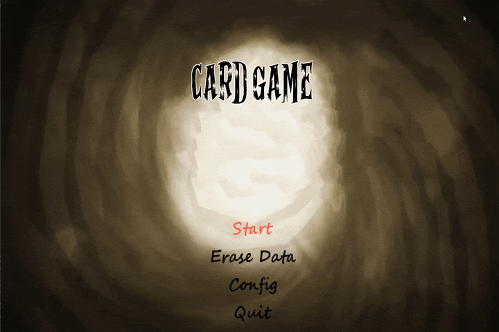

# UFGD Online Casino



A suite of card games developed in Pygame as a final project for an Object-Oriented Programming course at UFGD. The project showcases OOP principles, a Model-View-Controller (MVC) architecture, and a refactored data persistence system.

---

## ✨ Features

-   **MVC Architecture:** A clean separation between game logic (Model), the graphical interface (View), and flow control (Controller).
-   **Two Complete Games:**
    -   **Blackjack:** Play against the house with a betting system in a faithful implementation of the classic game.
    -   **UNO:** A full UNO match against three computer-controlled opponents.
-   **Win-Log Persistence:** Instead of player profiles, the game now saves a log of every win to `gamedata.dat`. Each record includes the player's name, score, the game, and the date/time of the victory.
-   **Dynamic Leaderboard:** A scores screen that allows filtering victories by game and sorts them from the highest to the lowest score.
-   **UI and Sound Effects:** Navigable menus, background music, and sound effects for a more immersive experience.

---

## 🏗️ Architectural Pattern: MVC

The project follows the Model-View-Controller pattern to promote a clean separation of concerns, making the codebase more modular and scalable.

-   **Model:** (`src/games/`, `src/classes/`)
    -   Contains the "brains" of the application. It manages the rules, state, and logic of the games (`BlackjackGame`, `UnoGame`). It is completely independent of the user interface.

-   **View:** (`src/interface.py`)
    -   Responsible for all things visual. It renders the user interface, the game board, and cards based on data from the Model. It captures user input and informs the Controller of the user's intentions.

-   **Controller:** (`src/main_game.py`)
    -   Acts as the orchestrator. It initializes the game, decides which screen to display next, instantiates the Models, and injects them into the Views when a game starts. It also coordinates saving wins with the `database_manager`.

---

## 🚀 How to Run

1.  **Prerequisites:**
    -   Python 3.x
    -   Pygame library (`pip install pygame`)

2.  **Execution:**
    -   Navigate to the project's root directory and run:
        ```bash
        python main.py
        ```

---

## 🎮 Controls

-   **Arrow Keys:** Navigate through menus and in-game options.
-   **Z / Enter:** Confirm a selection.
-   **X / Escape:** Go back or exit a submenu/screen.
-   **Blackjack - Hit:** Press `Z` or `H`.
-   **Blackjack - Stand:** Press `X` or `S`.
-   **UNO - Play/Draw Card:** Navigate with arrow keys and press `Z` to confirm.

---

## Documentação

- To get more information about the project, acess the documentation in ```cd docs/_build/html/index.html``` 
---

## 🧑‍💻 Authors

Developed with dedication by:
- **Abner Lucas Pereira Cardoso Vera**
- **Eduardo Rodrigues Rizzi**
- **Leandro Peres Sobreira**
- **Marcos Henrique Almeida Lima**
